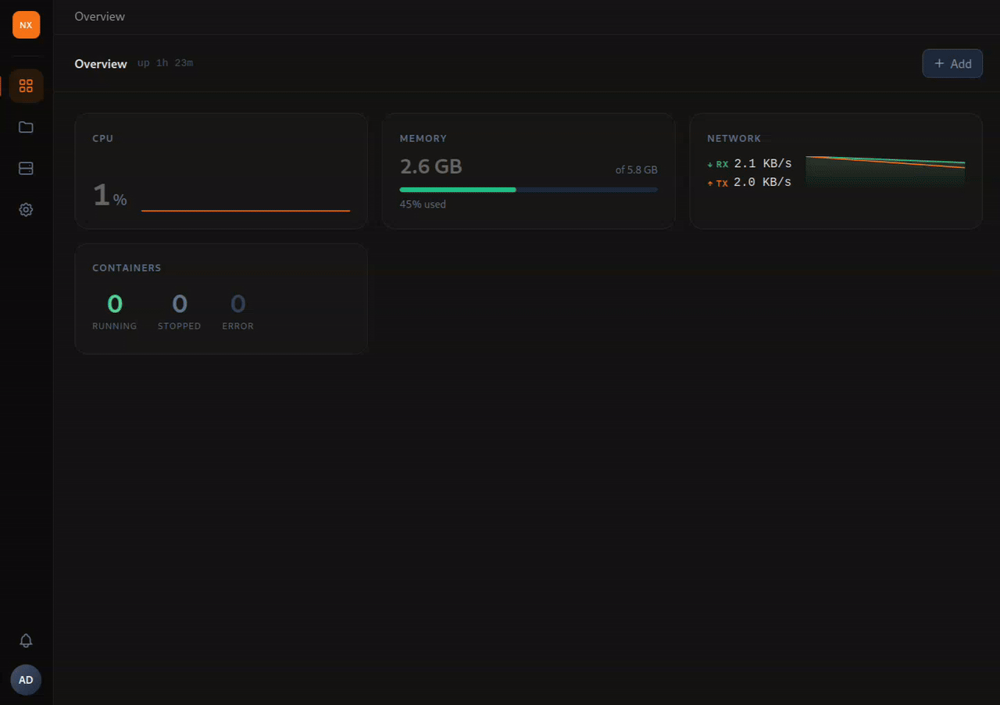

# Home Server Interface

> [!WARNING]
> **Early stage software.** This project is under active development and has not been audited for security. It may contain vulnerabilities, incomplete features, or breaking changes without notice. Use at your own risk, preferably on an isolated network.
> Tested on **Ubuntu 24.04** only. Other distributions are not officially supported.

A modern home server dashboard for self-hosting apps, media and storage.

---



---

| List view | Grid view |
|---|---|
|  |  |


---

## Features

### Two ways to work
- **Classic layout** — a fixed sidebar with one panel at a time; ideal on mobile.
- **Desktop mode** — a windowed desktop with a dock, launchpad, draggable/resizable app windows and a customizable wallpaper. Toggle it from the account menu.

### Overview
The home panel surfaces live system metrics at a glance: CPU, memory, disk usage, container status and recent activity.

### File browser
- Navigate folders, rename, move, copy, delete files and directories
- Drag-and-drop or picker upload with chunked transfer and live **MB/s throughput** display
- Pause, resume or cancel uploads mid-flight
- Click the throughput badge to switch to chunk count display
- One-click download

### Apps (containers)
- List, inspect, start, stop and restart containers
- Create containers with a full form: basic settings, port mappings, environment variables, volume mounts, networks, labels and advanced options
- Import a **compose YAML** to prefill the form automatically
- Manage container networks and volumes

### Storage (admin)
Dedicated app to manage the machine's block storage:
- **Disks** — list physical disks and partitions, view S.M.A.R.T. health, format, create/delete partition tables
- **RAID** — assemble and destroy `mdadm` arrays, monitor sync state
- **LVM** — create physical volumes, volume groups and logical volumes
- **Mounts** — mount/unmount devices, with optional persistent `/etc/fstab` entries

### Monitor (admin)
Live and historical system metrics (CPU %, RAM, network — 1h/6h/24h/7d), system information, and a filterable **audit log** of every privileged action.

### Network sharing (admin)
Share any Place over SMB via Samba, managed from the **Sharing** app: per-place read-only/guest options, live connections view, and NAS-style password sync across web, Linux and Samba accounts. Requires `samba` on the host.

### Places
Administrators define **Places** — named mount points that map a server path to a share visible in the browser. Users only see the shares they have access to.

### Users & roles
- Create users with individual Linux account mapping for filesystem-level permission enforcement
- Define roles via a **permission matrix** covering Users, Places, Files, Containers and System categories
- Assign users to roles; manage membership directly from the role editor
- Administrators always bypass permission checks

### Async operations
Heavy operations (copy, move, assemble large uploads) run as background jobs executed by a privileged worker process. The UI polls for completion and notifies you when done — no browser tab needs to stay open.

### Privilege isolation
The backend runs as an unprivileged user. A separate **root worker** process communicates over NATS JetStream and performs privileged operations (ownership-preserving copies, `chmod`, `chown`, user-impersonated writes, disk/RAID/LVM management, Samba config) in isolation. No `sudo` required at runtime.

### Consistent, animated UI
A token-based design system (semantic colors, radius scale, motion tokens with `prefers-reduced-motion` support) drives a coherent look in light and dark themes, with a user-selectable accent color.

---

## Documentation

Developer and operator documentation lives in [`docs/`](docs/):

- [Architecture](docs/architecture.md) — processes, privilege isolation, data flow, tech stack
- [Development](docs/development.md) — local setup, build, project layout, release process
- [Configuration](docs/configuration.md) — environment variables, services, install/update options
- [Design system](docs/design-system.md) — tokens, shared components and frontend conventions

---

## Requirements

- A Linux server (x86-64)
- `curl`, `openssl`
- Ports 80 (nginx, optional) and 9001 (backend) reachable from clients

---

## Install

```bash
curl -fsSL https://raw.githubusercontent.com/kittyruntime/home-server-interface/main/scripts/install.sh | sudo bash
```

The script:
1. Creates a system user
2. Installs Node.js 22 via nvm (in the app user's home)
3. Downloads and installs the [NATS](https://nats.io) message broker
4. Installs the `root-worker` privilege worker
5. Applies the database schema
6. Seeds an `admin / admin` account
7. Registers and starts three systemd services: `app-nats`, `app-root-worker`, `app`
8. Configures nginx if present

> **Change the admin password immediately after first login.**

### Update

Re-run the same command. The script detects an existing installation, preserves the database and all secrets, and restarts only the application services.

```bash
curl -fsSL https://raw.githubusercontent.com/kittyruntime/home-server-interface/main/scripts/install.sh | sudo bash
```

### Pin a version

```bash
curl -fsSL https://raw.githubusercontent.com/kittyruntime/home-server-interface/main/scripts/install.sh | sudo VERSION=v1.28.1 bash
```

---

## Services

| Unit | Role |
|---|---|
| `app-nats` | NATS JetStream message broker |
| `app-root-worker` | Privileged filesystem worker (runs as root) |
| `app` | Backend API + static file server |

```bash
systemctl status app app-root-worker app-nats
journalctl -u app -f
```

---

## Build from source

Requirements: Node.js ≥ 20, pnpm, Go ≥ 1.21, curl, openssl.

```bash
git clone https://github.com/kittyruntime/home-server-interface
cd home-server-interface
sudo bash scripts/install.sh
```

For a local development environment (dev servers, hot reload, project layout, release process) see [docs/development.md](docs/development.md).

---

## License

Free for personal, non-commercial use by private individuals.
Company and commercial use requires prior written agreement — see [LICENSE](LICENSE) for details.
