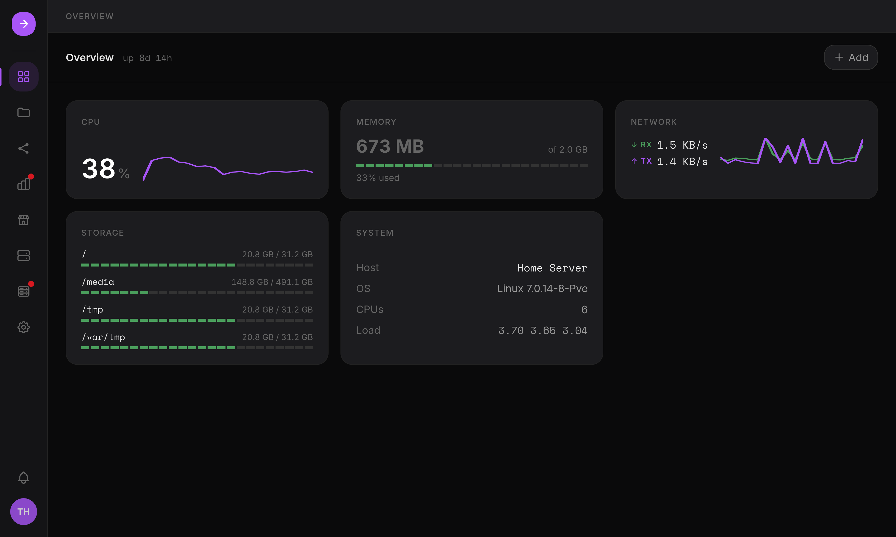
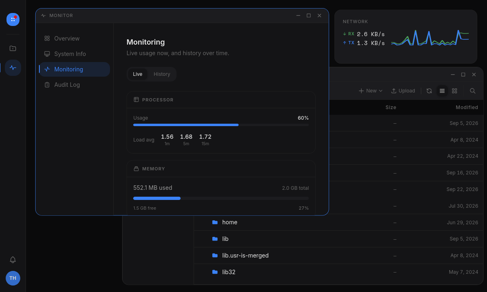
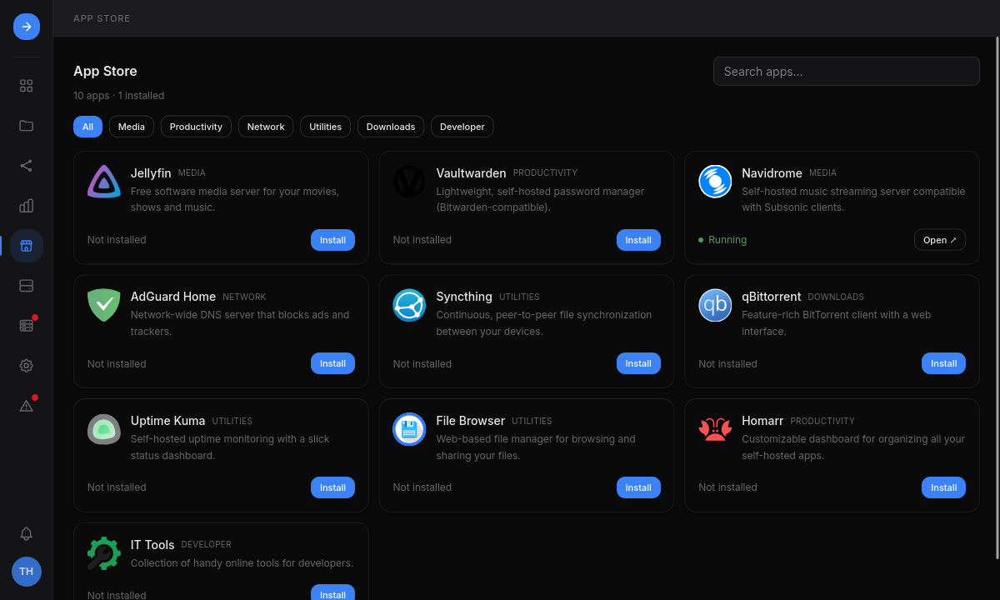
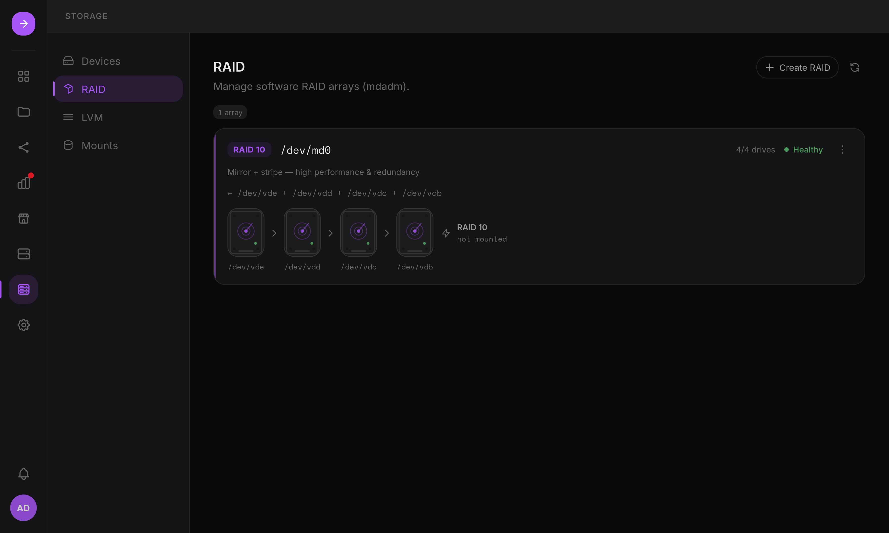
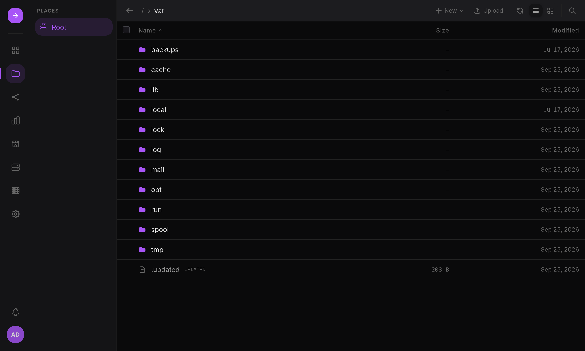
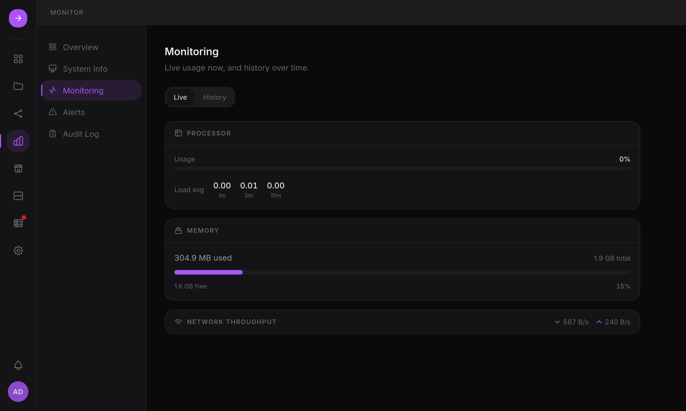

<p align="center">
  
</p>

<h1 align="center">Home Server Interface</h1>

<p align="center">
  <strong>Turn your Linux server into a private cloud, NAS, and app platform.</strong>
</p>

<p align="center">
  Home Server Interface (HSI) is an open-source control panel for a single Linux server:
  manage files, run Docker apps from a built-in App Store, operate real storage
  (S.M.A.R.T., RAID, LVM), and monitor your hardware, all from one modern dashboard,
  without giving up shell access to the machine underneath.
</p>

<p align="center">
  <a href="https://github.com/kittyruntime/home-server-interface/releases/latest"></a>
  <a href="LICENSE"></a>
  <a href="#requirements"></a>
</p>

<p align="center">
  <a href="#quick-install">Install</a> ·
  <a href="#features">Features</a> ·
  <a href="#screenshots">Screenshots</a> ·
  <a href="#why-hsi">Why HSI?</a> ·
  <a href="#documentation">Documentation</a> ·
  <a href="https://github.com/kittyruntime/home-server-interface/releases">Releases</a>
</p>

---

## Quick install

One command, on a fresh Ubuntu 24.04 server:

```bash
curl -fsSL https://raw.githubusercontent.com/kittyruntime/home-server-interface/main/scripts/install.sh | sudo bash
```

That's it: the installer sets up the app user, Node.js, the message broker, the
privileged worker, and the database, then starts HSI's systemd services. Full
details, updates and version pinning are in [Install](#install--update).

---

## Features

Every area below is real and in daily use, but HSI is still evolving quickly, so nothing
here is labeled "Stable" yet. `Beta` means it works and is actively maintained; `Experimental`
means it's new enough that interfaces may still change. See [Project status](#project-status)
for what that means in practice.

**Files** `Beta`: A full file manager in the browser, not an afterthought.
- Resumable, pause/resume chunked uploads with integrity checks
- Built-in code editor and expiring public share links
- "Places" with per-user and per-group permissions

**Apps & Docker** `Beta`: Run self-hosted apps and containers without touching a shell.
- Curated App Store with guided installs and pinned image versions
- Full container lifecycle: create, edit, logs, networks, mounts
- Import an existing Compose file to prefill a container
- App definitions live as standard Docker Compose files in `/opt/containers`, usable with or without HSI

**Storage** `Beta`: Real disk and array management, not just a usage bar.
- S.M.A.R.T. health, partitions, and disk formatting
- `mdadm` RAID and LVM, with guardrails against destructive actions
- Mounts and `/etc/fstab` management

**Monitoring** `Beta`: Know what your server is doing, live and over time.
- CPU, RAM, network and storage metrics with 1h–7d history
- Background alerts for RAID degradation and failing disks
- Filterable audit trail of privileged actions

**Users & Sharing** `Beta`: Multi-user from day one.
- Groups, per-place permissions, and admin/storage delegation
- Built-in SMB/Samba sharing, synced with HSI accounts
- Rate-limited logins and redacted audit values

**Backups** `Beta`: Two layers, so config and data are both covered.
- Encrypted (AES-256-GCM) HSI configuration backup and restore
- Scheduled rsync backups, local or over SSH, push or pull

Full feature details, including the desktop/windowed mode, live in the
[Documentation](#documentation).

---

## Screenshots

| Desktop mode | App Store |
|---|---|
|  |  |

| Docker | Storage |
|---|---|
|  |  |

| File manager | Monitoring |
|---|---|
|  |  |

See it in motion: [demo.gif](docs/demo.gif)

---

## Why HSI?

Most home-server tooling makes you choose between a friendly dashboard that hides
Linux, or a raw admin panel that assumes you already know the command line. HSI
aims for the middle ground:

- **Built for home servers, not adapted from enterprise infra.** Storage, Docker and
  Sharing are designed around what a home server actually does.
- **A real file manager, not an afterthought.** Chunked resumable uploads, an inline
  code editor, and shareable links are first-class features.
- **Storage you can actually operate.** S.M.A.R.T., partitions, `mdadm` RAID and LVM
  are managed from the UI, with guardrails against destructive operations.
- **Docker and an App Store together.** Run a curated app in one click, or manage any
  container by hand: same interface, same place.
- **Backups included.** Encrypted config backups and scheduled rsync jobs ship with
  HSI itself, not as a separate tool you have to wire up.
- **Security-conscious by design.** The web backend runs unprivileged; every
  root-level operation goes through a separate, isolated worker process over a
  message queue, not `sudo` calls from a Node process.
- **Linux stays visible.** HSI manages your server without hiding it: the Samba
  shares, `/etc/fstab` entries and systemd units it creates are things you can
  inspect and touch yourself.

If that sounds like something you'd want to run on your own hardware, a star on
GitHub helps more people find the project, and it takes one click.

---

## Project status

- **Active development.** New features ship regularly, and some interfaces may
  still change between releases.
- **Tested on Ubuntu 24.04** (x86-64). Other distributions are not officially
  supported.
- **Not security-audited.** Treat it like any early-stage self-hosted project.

> [!WARNING]
> HSI has not undergone a formal security audit and may contain vulnerabilities,
> incomplete protections, or breaking changes without notice. If you run it, keep
> it updated, avoid exposing it directly to the internet, and consider network
> isolation, especially while the project is this young.

---

## Requirements

- Ubuntu 24.04 on x86-64 (other distributions are not officially supported)
- `curl` and root access to run the install command (`sudo`, or `curl … | bash` from a root shell)
- The installer checks the other host packages it needs (storage tools such as `mdadm`,
  `smartmontools`, `lvm2`, `parted`, plus `openssl`, `rsync`, an OpenSSH client) and installs
  missing ones with `apt-get`; see [Configuration](docs/configuration.md#host-packages)
- Optional: Docker for containers and the App Store; Samba for SMB shares
- Ports 80 (nginx, optional) and 9001 (backend) reachable from clients

---

## Documentation

Developer and operator documentation lives in [`docs/`](docs/):

- [Architecture](docs/architecture.md): processes, privilege isolation, data flow, tech stack
- [Manage without HSI](docs/manage-without-hsi.md): the files and commands behind Docker, Samba, RAID, mounts and systemd, if HSI is down or gone
- [Development](docs/development.md): local setup, build, project layout, release process
- [Configuration](docs/configuration.md): environment variables, services, install/update options
- [Design system](docs/design-system.md): tokens, shared components and frontend conventions

---

## Install / update

```bash
curl -fsSL https://raw.githubusercontent.com/kittyruntime/home-server-interface/main/scripts/install.sh | sudo bash
```

The script:
1. Creates a system user
2. Installs Node.js 22 via nvm (in the app user's home)
3. Downloads and installs the [NATS](https://nats.io) message broker
4. Installs the `root-worker` privilege worker
5. Applies the database schema
6. Seeds an `admin / admin` account
7. Registers and starts three systemd services: `hsi-nats`, `hsi-root-worker`, `hsi`
8. Configures nginx if present

> **Change the admin password immediately after first login.**

### Update

Re-run the same command. The script detects an existing installation, preserves
the database and all secrets, and restarts the services.

### Pin a version

```bash
curl -fsSL https://raw.githubusercontent.com/kittyruntime/home-server-interface/main/scripts/install.sh | sudo VERSION=v1.54.0 bash
```

---

## Services

| Unit | Role |
|---|---|
| `hsi-nats` | NATS JetStream message broker |
| `hsi-root-worker` | Privileged filesystem worker (runs as root) |
| `hsi` | Backend API + static file server |

```bash
systemctl status hsi hsi-root-worker hsi-nats
journalctl -u hsi -f
```

---

## Build from source

Requirements: Node.js 20.19+ or 22.12+, pnpm, Go ≥ 1.25, curl, openssl, rsync and an OpenSSH client.

```bash
git clone https://github.com/kittyruntime/home-server-interface
cd home-server-interface
sudo bash scripts/install.sh --from-source
```

For a local development environment (dev servers, hot reload, project layout, release process) see [docs/development.md](docs/development.md).

---

## Contributing

HSI is open source and still shaping its roadmap, so feedback from real usage is
genuinely useful at this stage.

- **Found a bug?** Open an [issue](https://github.com/kittyruntime/home-server-interface/issues).
- **Missing a feature?** Open an issue describing the use case.
- **Want to contribute code?** Pull requests are welcome; see
  [docs/development.md](docs/development.md) for local setup.
- **General feedback** on the interface or the direction of the project is welcome
  via issues too.

Please read the [Code of Conduct](CODE_OF_CONDUCT.md) before participating.

---

## License

Home Server Interface is open-source software licensed under the
[Mozilla Public License 2.0](LICENSE).

You may use, modify, distribute and use the software commercially. Modifications
to files covered by the MPL must remain available under the MPL-2.0.

© 2025–2026 kittyruntime

---

<p align="center">
  If you find HSI useful or want to follow its development, consider giving the
  project a ⭐.
</p>
