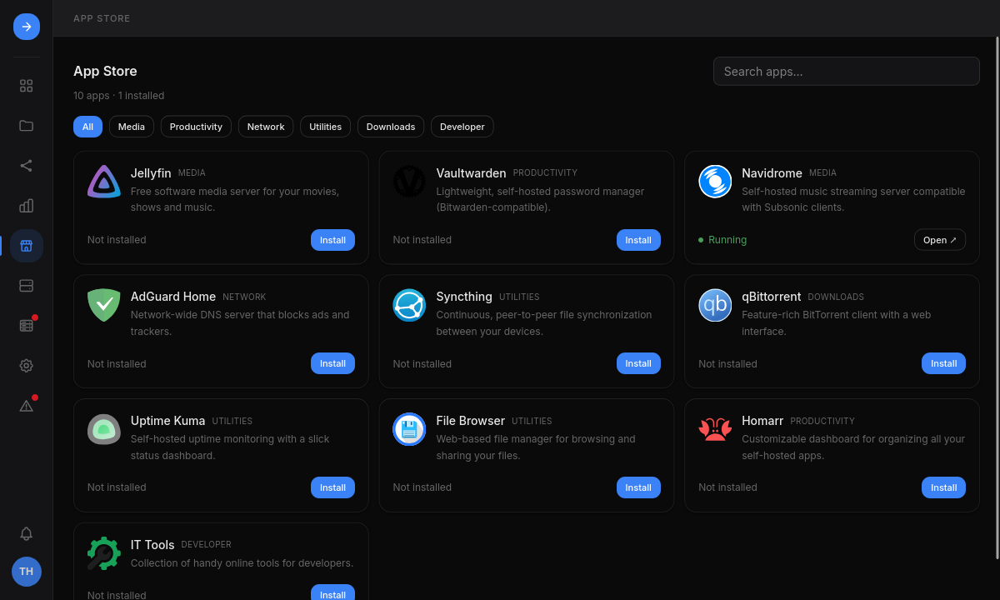

Run self-hosted apps and containers without a shell. Apps and containers are
admin-only.

- **App Store**: a curated catalog with guided installs and pinned image versions.
  Secret settings can be generated, and a port already in use comes with a free
  one to switch to. After an install, HSI opens the new app with its logs.
- **Containers**: create, edit, start, stop and delete containers, read their
  logs, and manage networks, volumes and mounts. An existing Compose file can be
  imported to prefill a container.
- **Previewed changes**: saving, applying, starting, installing and deleting show
  the `compose.yaml` content or its diff and the `docker compose` commands before
  they run. Secret-looking values are masked in the preview and the audit log.
- **Docker checks**: when Docker is not installed, not running or missing the
  compose plugin, the Apps page and the App Store say so with the command that
  fixes it.

Every app is a Docker Compose project in `/opt/containers/<name>/compose.yaml`,
usable with or without HSI. An app that stores data on a volume is stopped when
that volume goes missing.

## Without HSI

See [Docker](/home-server-interface/guide/manage-without-hsi/#docker).
