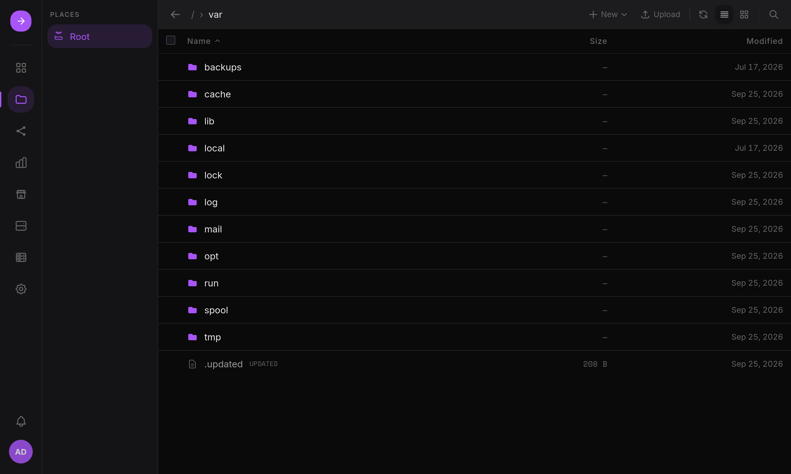

A full file manager in the browser.

- **Uploads** are chunked and resumable: each chunk retries after a network blip,
  uploads can be paused and resumed, and the server checks the whole file's
  SHA-256 against the one the browser computed. Progress shows in the Transfers
  tray.
- **Editor**: text and code files open in a built-in editor, with a Format action
  for JSON, YAML, CSS, HTML, Markdown, JavaScript and TypeScript.
- **Share links**: share a file or folder through a public link that expires.

## Places

A Place is a folder HSI exposes to its users, usually on a data volume. Access is
granted per user and per group, as Read, Write, Delete and Share. Administrators
have full access to every Place. A Place can be created when a volume is mounted,
so it shows up in Files right away, and shared over SMB (see
[Users and shares](/home-server-interface/guide/features/users-shares/)).

Writing through the file manager acts as your Linux user, exactly as over SMB, so
permissions are the same either way. A "permission denied" error says which
account the operation ran as and who owns the target folder.
