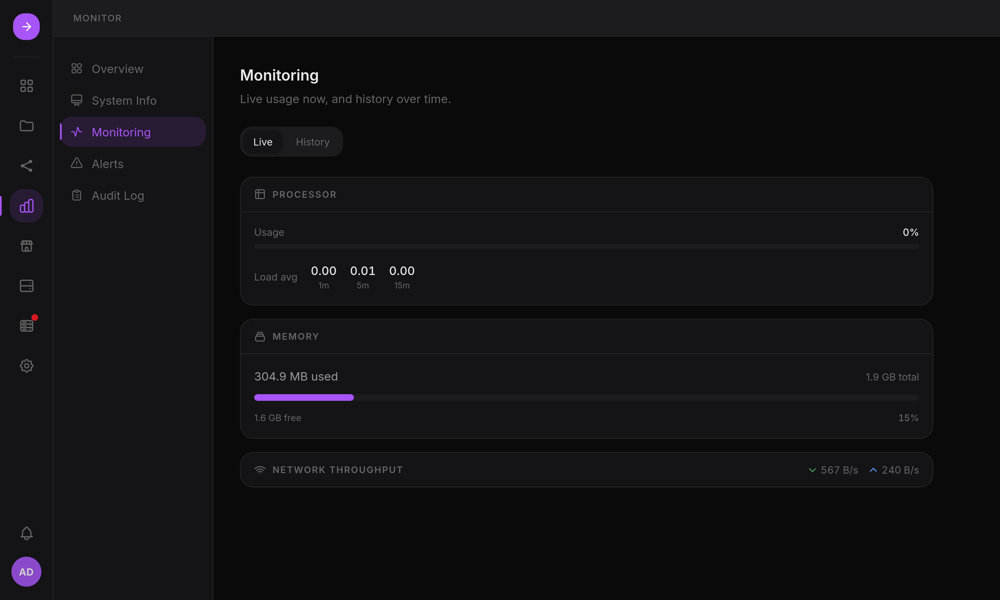

- **Metrics**: CPU, RAM, network and storage, live and over 1 hour to 7 days.
- **Alerts**: background checks raise alerts for a degraded array, a failing disk,
  a missing volume, a RAID consistency mismatch, a failed backup or update.
  Monitor > Alerts lists them; an alert whose condition is still true comes back
  at the next check.
- **Audit trail**: a filterable log of privileged actions, including every
  executed plan with the result of each step.

## Notifications

Settings > Notifications routes alerts to connectors through rules. Each rule
filters by source and minimum severity. A default rule sends all alerts to the
bell menu.

- **In-app**: the bell menu, with an unread badge.
- **Webhooks**: editable JSON payload templates with presets for Discord, Slack,
  ntfy and [SmallTV](https://github.com/giovi321/smalltv-mod) desk screens, a live
  preview and a test send.
- **Email**: SMTP with STARTTLS, TLS or none, presets for Gmail and Fastmail.

Webhook and email messages go through a queue stored in the database: they
survive a restart, are retried, and are rate-limited per connector. Connector
secrets are encrypted. Details are in
[Notifications](/home-server-interface/reference/configuration/#notifications).

HSI can only notify while it is running: use an external monitor to detect that
the server itself is down.
