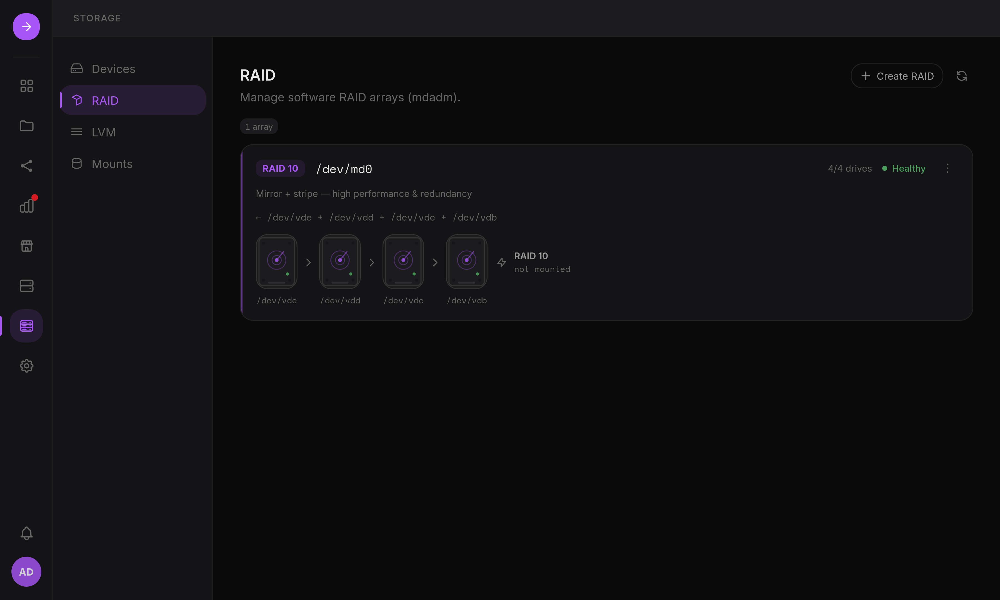

The Storage app manages the server's real disks: S.M.A.R.T. health, `mdadm` RAID,
LVM and mounts. It opens on **Volumes**, where the data lives.

## Volumes

Each data filesystem is listed with its redundancy (mirror, RAID 5...), space,
health (degraded or rebuilding array, missing at boot, nearly full, SMART) and
what uses it (Places, shares, apps), next to the free disks and the system disk's
free space. Each volume has its own page with Overview, Structure and Activity
tabs: what it is made of from the folder down to the disks, and the operations
recorded on it.

- **Create a volume**: Storage > Volumes > Create volume goes from free disks to a
  ready-to-use volume in one flow: choose the disks, the redundancy (mirror,
  RAID 5, 6, 10, or none), the LVM layout, the filesystem label and the folder,
  who owns it, and, for admins, a Place and an SMB share.
- **Expand a volume**: from a volume's page (Expand...), grow it in place without
  reformatting: into the free space of its volume group, with a disk added to its
  RAID 5/6 array or to a volume without redundancy, or into the larger disks of
  its mirror. A RAID reshape takes hours: the volume stays usable, and HSI grows
  LVM and the filesystem (ext4, XFS, btrfs) when it ends, then sends a
  notification with the new size.
- **Remove a volume**: Overview > Remove this volume stops sharing its Places,
  unmounts it, deletes its logical volume (and its volume group and array when
  they serve only this volume), then erases the disks so they show as free again.
  Remove stays disabled until the volume name is typed; a volume an app stores
  data on cannot be removed.
- **Mount**: an unmounted volume can be mounted from the Volumes page, with its
  owner, an optional Place, and "Persist across reboots" (an `/etc/fstab` entry).

## Disks

Each disk shows its stable `/dev/disk/by-id` name next to the kernel name
(`/dev/sdb`), its S.M.A.R.T. health and temperature, and the volumes it carries.
A disk can be given a label ("bay 3, top") that follows it by serial number.
Partitions and formatting are available on free disks; disks used by an array or
a volume group are read-only in the UI.

## Arrays and volume groups

Each RAID array and LVM volume group has its own page: state, members, what it
carries and its operations.

- **Replace a failed disk**: members are listed as Active, Rebuilding, Failed or
  Spare with their model and serial number. Mark a disk as failed, remove it and
  add a replacement (only free disks large enough are offered); rebuild progress
  is shown live.
- **Import existing storage**: arrays and volume groups found on the disks but
  not running (disks moved from another machine, or after a reinstall) are
  listed and can be assembled or activated without formatting.

## Descriptions and drift

Each volume is described in `/etc/hsi/storage/`, readable without HSI: its disks by
serial number, its array, LVM, filesystem and mount. When the server no longer
matches it (a disk swapped by hand, an fstab line removed, an array stopped), the
volume's page says what differs, with **Reapply** to put the server back in line
and **Accept current state** to keep the change. See
[Storage descriptions](/home-server-interface/guide/storage-descriptions/).

## Every change is a plan

Formatting, partitions, arrays, LVM and mounts are shown as a plan before
anything runs: every command, every file change as a diff, and the disks that
will be erased with their model and serial number. See
[Plans and missing volumes](/home-server-interface/reference/storage-plans/).

## Without HSI

Arrays, volume groups and mounts are standard `mdadm`, LVM and `/etc/fstab`
configuration: see [RAID](/home-server-interface/guide/manage-without-hsi/#raid-mdadm) and
[Mounts](/home-server-interface/guide/manage-without-hsi/#mounts).
