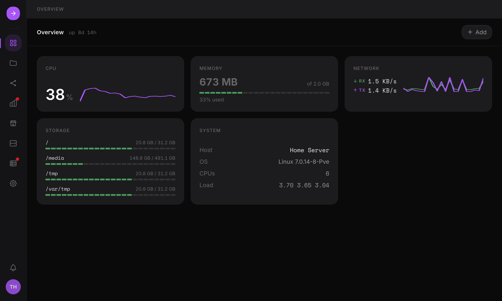

import { Card, CardGrid, LinkCard } from "@astrojs/starlight/components"

## Why HSI?

Most home-server tooling makes you choose between a friendly dashboard that hides
Linux, or a raw admin panel that assumes you already know the command line. HSI
aims for the middle ground.

<CardGrid>
  <Card title="Storage you can operate" icon="setting">
    S.M.A.R.T., `mdadm` RAID, LVM and mounts from the UI, with every change shown
    as a plan before it runs.
  </Card>
  <Card title="A real file manager" icon="document">
    Resumable uploads, an inline editor, share links and per-user Places.
  </Card>
  <Card title="Apps and Docker together" icon="rocket">
    A curated App Store, or any container by hand, stored as standard Compose files.
  </Card>
  <Card title="Linux stays visible" icon="open-book">
    The shares, fstab entries and systemd units HSI writes are yours to inspect and
    edit. The backend runs unprivileged; root operations go through an isolated worker.
  </Card>
</CardGrid>

## Learn more

<CardGrid>
  <LinkCard title="Install" href="/home-server-interface/guide/install/" description="Requirements, the install command and the first login." />
  <LinkCard title="Manage without HSI" href="/home-server-interface/guide/manage-without-hsi/" description="The files and commands behind everything HSI manages." />
  <LinkCard title="Architecture" href="/home-server-interface/development/architecture/" description="How the backend, the privileged worker and the broker fit together." />
  <LinkCard title="Development" href="/home-server-interface/development/setup/" description="Run HSI locally and contribute." />
</CardGrid>
